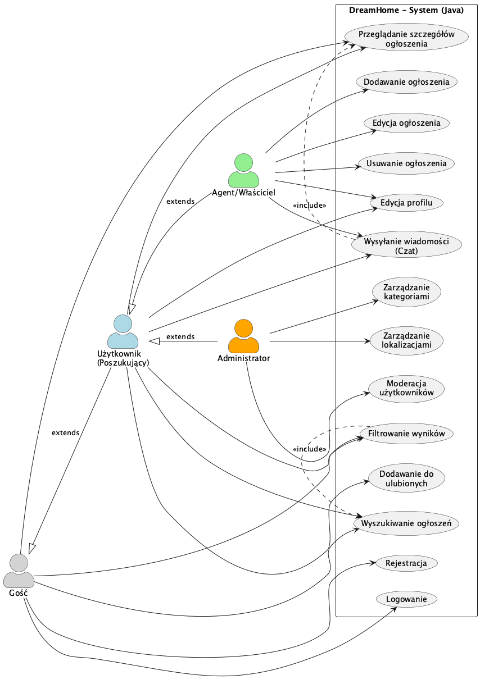
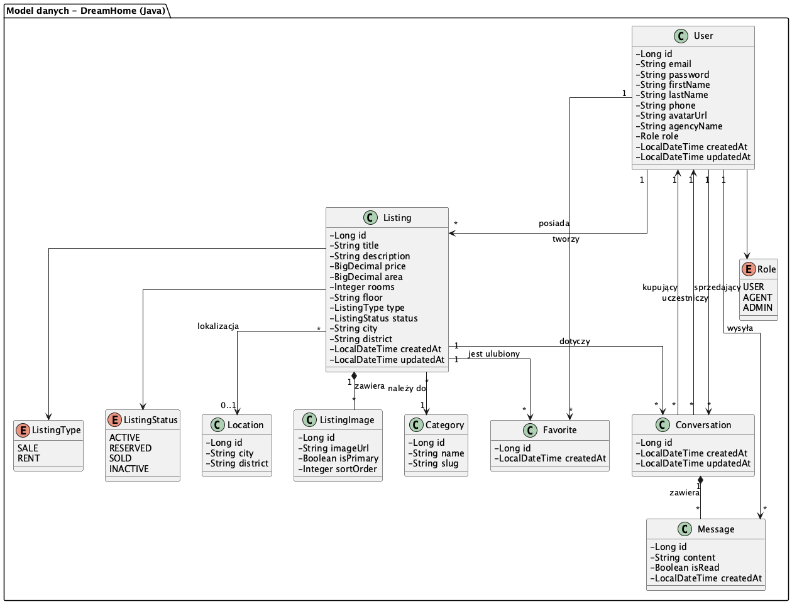
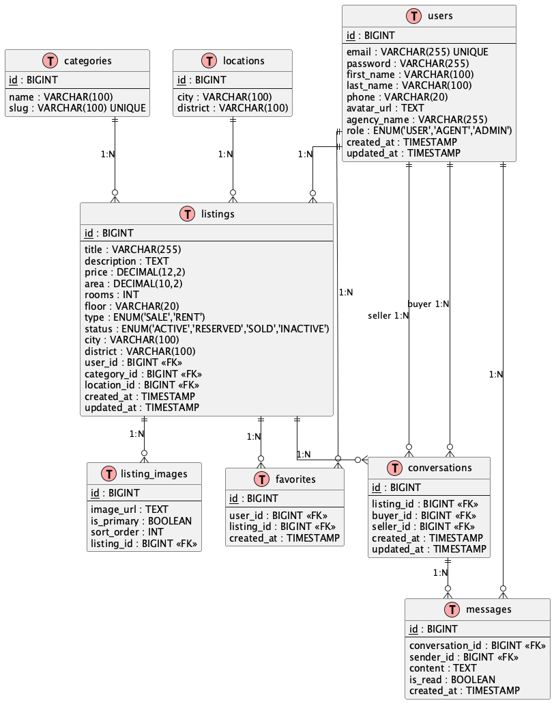

<div align="center">

# DOKUMENTACJA PROJEKTU SERWISU WWW

**DreamHome - Wersja Java (Spring Boot)**

---

**Uczelnia:** Uniwersytet Morski w Gdyni  
**Wydział:** Informatyki  
**Przedmiot:** Programowanie aplikacji webowych  
**Kierunek:** Informatyka, Aplikacje internetowe i mobilne  
**Semestr:** 5

---

</div>

### Autor

**Piotr Capecki**

---

## 1. Nazwa i temat serwisu/aplikacji

**Nazwa:** DreamHome  
**Temat:** Internetowy serwis ogłoszeniowy do wynajmu i sprzedaży nieruchomości.

Projekt zakłada stworzenie platformy łączącej właścicieli nieruchomości oraz agencje z osobami poszukującymi mieszkań, domów lub lokali użytkowych. Wersja oparta na backendzie **Java Spring Boot** oferuje dodatkowo **system komunikacji w czasie rzeczywistym (czat)**.

---

## 2. Cel istnienia serwisu z punktu widzenia właściciela

Głównym celem biznesowym aplikacji DreamHome jest:

* **Stworzenie intuicyjnego narzędzia** pośredniczącego w obrocie nieruchomościami, dostępnego dla szerokiego grona użytkowników.
* **Zbudowanie bazy wiarygodnych ogłoszeń**, co pozwoli na przyszłą monetyzację serwisu poprzez:
  - Wyróżnianie ofert (promowane ogłoszenia)
  - Konta premium dla agencji nieruchomości
  - Reklamy kontekstowe
* **Umożliwienie bezpośredniej komunikacji** między stronami transakcji za pomocą wbudowanego systemu wiadomości (czat w czasie rzeczywistym).
* **Dostarczenie użytkownikom platformy** o wysokim standardzie User Experience (UX), zachęcającej do powrotu i polecania innym.

---

## 3. Ogólny opis przeznaczenia i działania serwisu

Serwis DreamHome funkcjonuje jako **marketplace nieruchomości**. Umożliwia przeglądanie bazy ofert (dostępne publicznie) oraz aktywną interakcję między użytkownikami (dla zalogowanych).

### Role użytkowników

| Rola | Uprawnienia |
|------|-------------|
| **Gość (Niezalogowany)** | Przeglądanie strony głównej, korzystanie z wyszukiwarki i filtrów, podgląd szczegółów ogłoszenia. |
| **Użytkownik Zalogowany (Poszukujący)** | Funkcje Gościa + możliwość dodawania ogłoszeń do "Ulubionych", wysyłanie wiadomości do agentów (czat), edycja własnego profilu. |
| **Ogłoszeniodawca (Agent/Właściciel)** | Funkcje Użytkownika + zarządzanie własnymi ofertami (dodawanie, edycja, usuwanie, zmiana statusu), odbieranie wiadomości od zainteresowanych klientów. |
| **Administrator** | Pełen dostęp do systemu, zarządzanie słownikami (Kategorie, Lokalizacje), moderacja użytkowników, dostęp do wszystkich ogłoszeń. |

---

## 4. Główna grupa docelowa

### 4.1 Poszukujący nieruchomości
* **Wiek:** 19-50 lat (studenci, single, młode rodziny)
* **Cechy:** Cenią szybki kontakt z ogłoszeniodawcą, przejrzystość danych i możliwość filtrowania ofert
* **Potrzeby:** Intuicyjne wyszukiwanie, podgląd zdjęć, szybka komunikacja

### 4.2 Oferujący nieruchomości
* **Profil:** Właściciele prywatni oraz małe/średnie agencje nieruchomości
* **Potrzeby:** Nowoczesne narzędzie do prezentacji ofert, zarządzanie leadami, śledzenie zainteresowania ofertami
* **Oczekiwania:** Alternatywa dla drogich i przeładowanych reklamami portali ogłoszeniowych

---

## 5. Przegląd rozwiązań konkurencyjnych

### Analiza konkurencji

| Serwis | Zalety | Wady |
|--------|--------|------|
| **Otodom.pl** | Lider rynku, duża baza ofert, rozbudowane filtry | Wysokie koszty dla ogłoszeniodawców, nadmiar reklam |
| **OLX Nieruchomości** | Popularność, niski próg wejścia | Duży spam, niska jakość ogłoszeń, brak weryfikacji |
| **Morizon.pl** | Agregator ofert z wielu źródeł | Brak bezpośredniej komunikacji, duplikaty ogłoszeń |

### Przewaga konkurencyjna DreamHome (Java)

* **🗨️ Wbudowany komunikator:** Bezpośredni czat w czasie rzeczywistym (WebSocket) eliminuje konieczność dzwonienia lub mailowania.
* **🎨 Minimalistyczny UX:** Brak rozpraszających reklam, skupienie na zdjęciach i kluczowych parametrach nieruchomości.
* **⚡ Szybkość i wydajność:** Wykorzystanie nowoczesnego backendu Java Spring Boot zapewnia wysoką wydajność i skalowalność.
* **✅ Weryfikacja danych:** System wymusza podanie kluczowych parametrów (metraż, pokoje, cena) – brak "pustych" ogłoszeń.

---

## 6. Wymagania funkcjonalne i niefunkcjonalne

### 6.1 Wymagania funkcjonalne

1. **Rejestracja i logowanie** – uwierzytelnianie użytkowników z wykorzystaniem JWT.
2. **Wyszukiwanie ogłoszeń** – zaawansowane filtrowanie po cenie, metrażu, liczbie pokoi, typie transakcji, lokalizacji.
3. **Przeglądanie szczegółów** – galeria zdjęć, pełen opis, dane kontaktowe agenta.
4. **Zarządzanie ogłoszeniami** – CRUD (dodawanie, edycja, usuwanie), upload wielu zdjęć, zmiana statusu oferty.
5. **System Ulubionych** – zapisywanie interesujących ofert na liście obserwowanych.
6. **💬 System Wiadomości (Czat)** – wysyłanie i odbieranie wiadomości w czasie rzeczywistym między kupującym a sprzedającym.
7. **Zarządzanie profilem** – edycja danych osobowych, zmiana hasła, upload awatara.
8. **Panel Administratora** – zarządzanie kategoriami, lokalizacjami, moderacja użytkowników.

### 6.2 Wymagania niefunkcjonalne

1. **Bezpieczeństwo:**
   - Szyfrowanie haseł algorytmem BCrypt
   - Walidacja wszystkich danych wejściowych
   - Zabezpieczenie endpointów (Spring Security + JWT)
   - Ochrona przed XSS i CSRF
   
2. **Skalowalność:**
   - Architektura warstwowa gotowa na duży ruch
   - WebSocket do obsługi wielu jednoczesnych połączeń czatu
   
3. **Responsywność (RWD):**
   - Interfejs dostosowany do ekranów smartfonów, tabletów i desktopów
   
4. **Obsługa błędów:**
   - Czytelne komunikaty błędów dla użytkownika
   - Globalny handler wyjątków

### 6.3 Diagram Przypadków Użycia (Use Case Diagram)



*Diagram przedstawia główne funkcjonalności systemu z uwzględnieniem ról użytkowników. Charakterystyczna dla wersji Java jest funkcjonalność **"Wysyłanie wiadomości (Czat)"** dostępna dla zalogowanych użytkowników.*

---

## 7. Schemat nawigacji

### Struktura nawigacji dla poszczególnych ról

**1. Strefa Publiczna (Gość):**
```
Strona Główna → Wyniki Wyszukiwania → Szczegóły Ogłoszenia
                         ↓
              Logowanie / Rejestracja
```

**2. Strefa Użytkownika (Poszukujący):**
```
Dashboard → Ulubione Ogłoszenia
         → Moje Wiadomości (Czat) → Konwersacja
         → Edycja Profilu
```

**3. Strefa Agenta (Ogłoszeniodawca):**
```
Dashboard → Moje Ogłoszenia → Dodaj/Edytuj Ogłoszenie
         → Wiadomości od klientów → Konwersacja
```

**4. Strefa Administratora:**
```
Panel Admina → Zarządzanie Kategoriami
            → Zarządzanie Lokalizacjami
            → Lista Użytkowników
```

### Menu główne

| Element | Gość | Użytkownik | Agent | Admin |
|---------|------|------------|-------|-------|
| Logo/Home | ✓ | ✓ | ✓ | ✓ |
| Wyszukiwarka | ✓ | ✓ | ✓ | ✓ |
| Zaloguj | ✓ | - | - | - |
| Zarejestruj | ✓ | - | - | - |
| Dashboard | - | ✓ | ✓ | ✓ |
| Ulubione | - | ✓ | ✓ | - |
| Wiadomości | - | ✓ | ✓ | - |
| Moje Ogłoszenia | - | - | ✓ | - |
| Panel Admin | - | - | - | ✓ |
| Wyloguj | - | ✓ | ✓ | ✓ |

---

## 8. Model bazy danych

System oparty jest o relacyjną bazę danych **PostgreSQL**. Model zawiera **7 głównych tabel** (spełniając wymóg minimum 5 tabel).

### 8.1 Opis tabel

| Tabela | Opis | Kluczowe pola |
|--------|------|---------------|
| `users` | Dane użytkowników systemu | id, email, password, role, firstName, lastName |
| `listings` | Ogłoszenia nieruchomości | id, title, price, area, rooms, type, status |
| `listing_images` | Zdjęcia przypisane do ogłoszeń | id, imageUrl, isPrimary, listingId |
| `categories` | Słownik kategorii (Mieszkanie, Dom, itp.) | id, name, slug |
| `locations` | Słownik lokalizacji | id, city, district |
| `favorites` | Relacja użytkownik-ulubione ogłoszenie | id, userId, listingId |
| `conversations` | Pokoje czatu między użytkownikami | id, listingId, buyerId, sellerId |
| `messages` | Treść wiadomości w ramach konwersacji | id, conversationId, senderId, content |

### 8.2 Diagram Klas UML (Class Diagram)



*Diagram przedstawia strukturę encji w systemie wraz z relacjami. Klasy `Conversation` i `Message` są charakterystyczne dla wersji Java (system czatu).*

### 8.3 Diagram ERD (Entity Relationship Diagram)



*Diagram relacji encji przedstawia strukturę tabel bazy danych z kluczami głównymi (PK), obcymi (FK) oraz liczebnościami relacji.*

### 8.4 Relacje między tabelami

| Relacja | Typ | Opis |
|---------|-----|------|
| `users` → `listings` | 1:N | Jeden użytkownik może mieć wiele ogłoszeń |
| `users` ↔ `favorites` ↔ `listings` | N:M | Użytkownicy mogą mieć wiele ulubionych ofert |
| `listings` → `listing_images` | 1:N | Ogłoszenie może mieć wiele zdjęć |
| `categories` → `listings` | 1:N | Kategoria przypisana do wielu ogłoszeń |
| `users` ↔ `conversations` | N:N | Użytkownicy uczestniczą w konwersacjach |
| `conversations` → `messages` | 1:N | Konwersacja zawiera wiele wiadomości |

---

## 9. Schematy graficzne stron (Wireframes)

Układ graficzny serwisu oparty jest o zasady **"Clean UI"** – minimalistyczny design skupiony na treści. Interfejs jest w pełni responsywny (RWD).

### 9.1 Widok Strony Głównej (Home)

Strona startowa zawiera nagłówek z nawigacją, sekcję Hero z wyszukiwarką oraz siatkę wyróżnionych ofert.

* **Układ:** Sticky Header + Hero Section + CSS Grid (oferty)
* **RWD:** Na urządzeniach mobilnych siatka zmienia się w układ jednokolumnowy

#### Wersja Desktop


#### Wersja Mobile


### 9.2 Widok Szczegółów Ogłoszenia (Listing Details)

Widok prezentujący szczegółowe dane oferty z galerią zdjęć.

* **Układ:** Dwie kolumny (Lewa: Galeria i opis | Prawa: Cena i dane kontaktowe)
* **RWD:** Na smartfonach prawa kolumna przesuwa się pod sekcję opisu

#### Wersja Desktop


#### Wersja Mobile


### 9.3 Widok Panelu Użytkownika (Dashboard)

Panel zarządzania dla zalogowanego użytkownika z dostępem do ogłoszeń i wiadomości.

* **Układ:** Panel boczny (Sidebar) z menu + Główny obszar roboczy
* **Funkcje:** Tabela z listą ogłoszeń, przyciski akcji, statusy ofert

#### Wersja Desktop


#### Wersja Mobile


### 9.4 Widok Czatu (Wiadomości) - Tylko Java

Panel komunikacji w czasie rzeczywistym między kupującym a sprzedającym.

* **Układ:** Lista konwersacji (lewa kolumna) + Okno czatu (prawa kolumna)
* **Funkcje:** Historia wiadomości, wskaźnik nieprzeczytanych, wysyłanie wiadomości

*Zrzut ekranu czatu zostanie dodany po implementacji funkcjonalności.*

---

## 10. Technologie i rozwiązania

### 10.1 Stack technologiczny

#### Backend (Java)

| Technologia | Wersja | Zastosowanie |
|-------------|--------|--------------|
| **Java** | 21 LTS | Główny język programowania |
| **Spring Boot** | 3.x | Framework aplikacji webowej |
| **Spring Security** | 6.x | Autoryzacja i uwierzytelnianie |
| **Spring Data JPA** | - | Warstwa dostępu do danych (ORM) |
| **Hibernate** | 6.x | Implementacja JPA |
| **PostgreSQL** | 15+ | Relacyjna baza danych |
| **JWT (JSON Web Token)** | - | Tokeny autoryzacyjne |
| **WebSocket (STOMP)** | - | Komunikacja w czasie rzeczywistym (czat) |
| **Lombok** | - | Redukcja boilerplate code |
| **MapStruct** | - | Mapowanie DTO ↔ Entity |
| **Gradle** | 8.x | Narzędzie budowania projektu |

#### Frontend

| Technologia | Zastosowanie |
|-------------|--------------|
| **React** | Biblioteka UI (SPA) |
| **TypeScript** | Typowany JavaScript |
| **Vite** | Bundler i dev server |
| **TailwindCSS** | Framework CSS (utility-first) |
| **Axios** | Klient HTTP |
| **React Router** | Routing po stronie klienta |
| **Zustand** | Zarządzanie stanem aplikacji |

#### Narzędzia deweloperskie

| Narzędzie | Zastosowanie |
|-----------|--------------|
| **Git** | Kontrola wersji |
| **Docker** | Konteneryzacja (opcjonalnie) |
| **Postman** | Testowanie API |

### 10.2 Architektura aplikacji

Aplikacja wykorzystuje **architekturę warstwową**:

```
┌─────────────────────────────────────────────────┐
│                  FRONTEND (React)               │
│         SPA + REST API + WebSocket              │
└─────────────────────────────────────────────────┘
                        ↓ HTTP / WS
┌─────────────────────────────────────────────────┐
│              CONTROLLER LAYER                   │
│   REST Controllers + WebSocket Handlers         │
└─────────────────────────────────────────────────┘
                        ↓
┌─────────────────────────────────────────────────┐
│               SERVICE LAYER                     │
│        Logika biznesowa + Walidacja             │
└─────────────────────────────────────────────────┘
                        ↓
┌─────────────────────────────────────────────────┐
│              REPOSITORY LAYER                   │
│         Spring Data JPA + Hibernate             │
└─────────────────────────────────────────────────┘
                        ↓
┌─────────────────────────────────────────────────┐
│               DATABASE (PostgreSQL)             │
└─────────────────────────────────────────────────┘
```

### 10.3 Kluczowe rozwiązania techniczne

1. **DTO Pattern** – Separacja encji bazodanowych od obiektów transferu danych
2. **Global Exception Handler** – Centralna obsługa błędów z czytelnymi komunikatami
3. **JWT Authentication** – Bezstanowe uwierzytelnianie z tokenami
4. **WebSocket (STOMP)** – Dwukierunkowa komunikacja dla funkcji czatu
5. **Lazy Loading** – Optymalizacja zapytań JPA
6. **File Upload Service** – Obsługa przesyłania i przechowywania zdjęć

---

## Podsumowanie

Projekt **DreamHome (Java)** stanowi kompleksowe rozwiązanie dla serwisu ogłoszeniowego nieruchomości. Wyróżniającą cechą tej wersji jest **system komunikacji w czasie rzeczywistym (czat)** oparty na technologii WebSocket, który pozwala na bezpośredni kontakt między zainteresowanymi stronami transakcji.

Zastosowanie nowoczesnego stosu technologicznego (Java 21, Spring Boot 3, React, TypeScript) zapewnia wysoką wydajność, bezpieczeństwo i łatwość rozwoju aplikacji.

---
