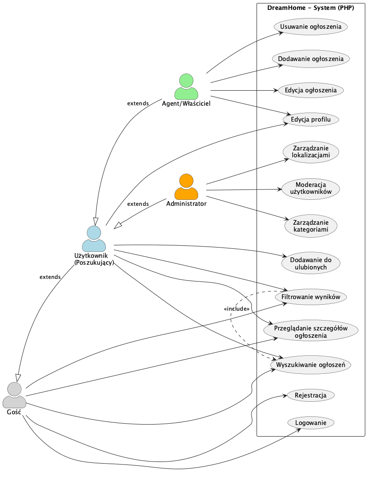
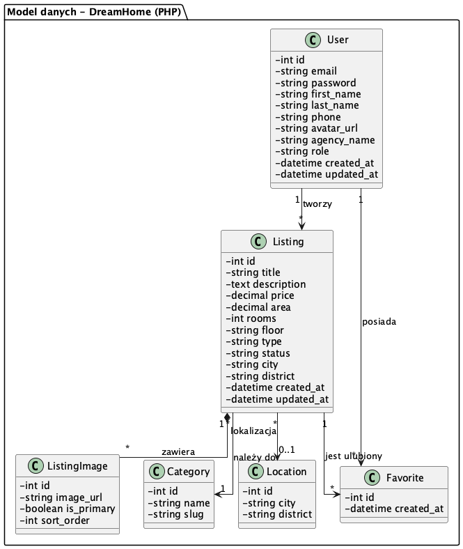
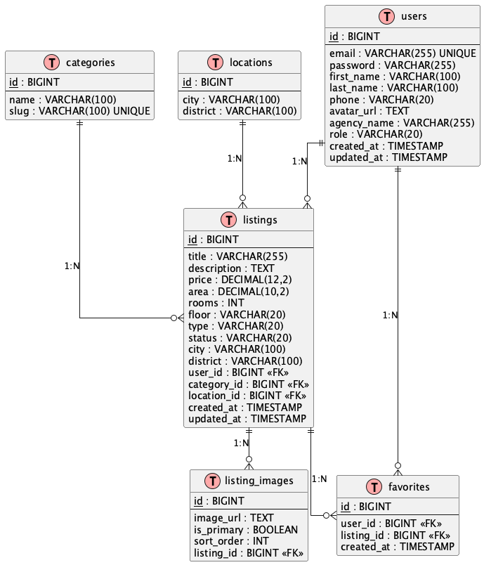
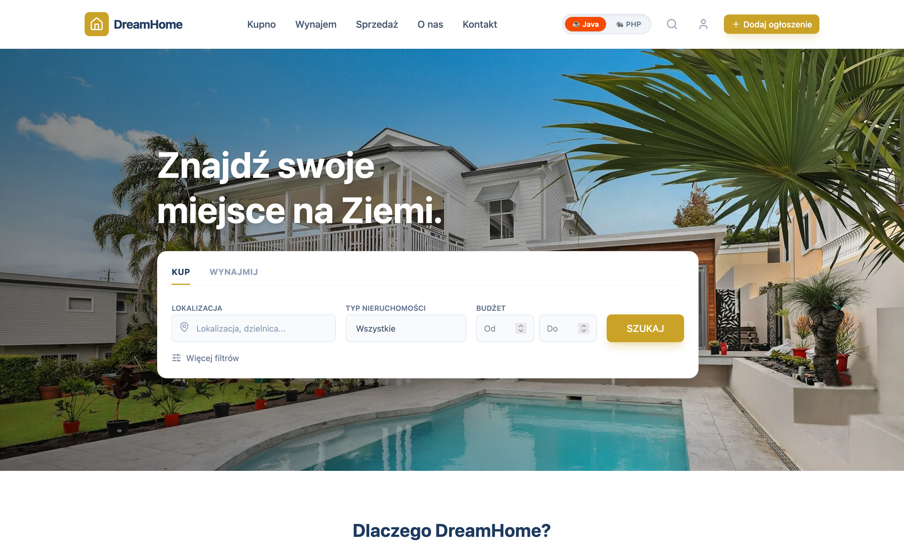
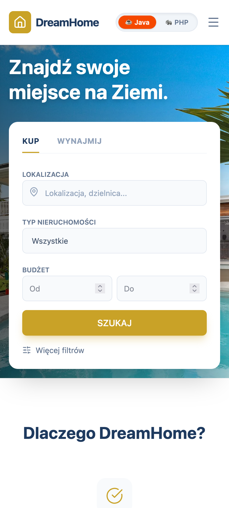
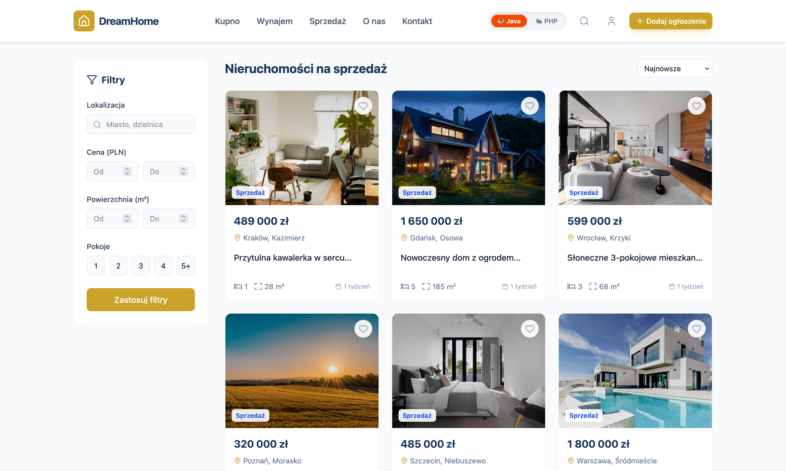
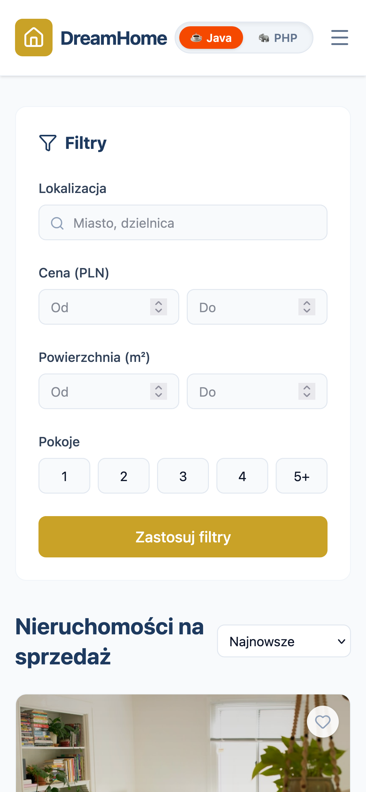
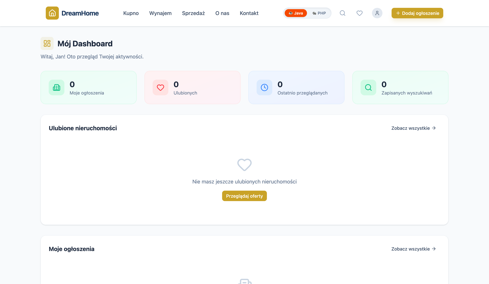
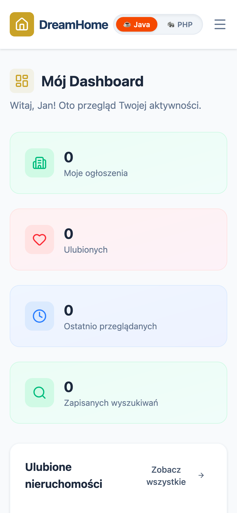

<div align="center">

# DOKUMENTACJA PROJEKTU SERWISU WWW

**DreamHome - Wersja PHP (Laravel)**

---

**Uczelnia:** Uniwersytet Morski w Gdyni  
**Wydział:** Informatyki  
**Przedmiot:** Projektowanie serwisów internetowych  
**Kierunek:** Informatyka, Aplikacje internetowe i mobilne  
**Semestr:** 5

---

</div>

### Autor

**Piotr Capecki**

---

## 1. Nazwa i temat serwisu/aplikacji

**Nazwa:** DreamHome  
**Temat:** Internetowy serwis ogłoszeniowy do wynajmu i sprzedaży nieruchomości.

Projekt zakłada stworzenie platformy łączącej właścicieli nieruchomości oraz agencje z osobami poszukującymi mieszkań, domów lub lokali użytkowych. Wersja oparta na backendzie **PHP Laravel** realizuje klasyczne funkcjonalności serwisu ogłoszeniowego.

---

## 2. Cel istnienia serwisu z punktu widzenia właściciela

Głównym celem biznesowym aplikacji DreamHome jest:

* **Stworzenie intuicyjnego narzędzia** pośredniczącego w obrocie nieruchomościami, dostępnego dla szerokiego grona użytkowników.
* **Zbudowanie bazy wiarygodnych ogłoszeń**, co pozwoli na przyszłą monetyzację serwisu poprzez:
  - Wyróżnianie ofert (promowane ogłoszenia)
  - Konta premium dla agencji nieruchomości
  - Reklamy kontekstowe
* **Dostarczenie użytkownikom platformy** o wysokim standardzie User Experience (UX), zachęcającej do powrotu i polecania innym.

---

## 3. Ogólny opis przeznaczenia i działania serwisu

Serwis DreamHome funkcjonuje jako **marketplace nieruchomości**. Umożliwia przeglądanie bazy ofert (dostępne publicznie) oraz zarządzanie nimi przez zarejestrowanych użytkowników.

### Role użytkowników

| Rola | Uprawnienia |
|------|-------------|
| **Gość (Niezalogowany)** | Przeglądanie strony głównej, korzystanie z wyszukiwarki i filtrów, podgląd szczegółów ogłoszenia. |
| **Użytkownik Zalogowany (Poszukujący)** | Funkcje Gościa + możliwość dodawania ogłoszeń do "Ulubionych", edycja własnego profilu. |
| **Ogłoszeniodawca (Agent/Właściciel)** | Funkcje Użytkownika + zarządzanie własnymi ofertami (dodawanie, edycja, usuwanie, zmiana statusu). |
| **Administrator** | Pełen dostęp do systemu, zarządzanie słownikami (Kategorie, Lokalizacje), moderacja użytkowników, dostęp do wszystkich ogłoszeń. |

---

## 4. Główna grupa docelowa

### 4.1 Poszukujący nieruchomości
* **Wiek:** 19-50 lat (studenci, single, młode rodziny)
* **Cechy:** Szukają wygodnego sposobu na znalezienie nieruchomości, cenią przejrzystość ofert
* **Potrzeby:** Intuicyjne wyszukiwanie, podgląd zdjęć, możliwość zapisania ulubionych ofert

### 4.2 Oferujący nieruchomości
* **Profil:** Właściciele prywatni oraz małe/średnie agencje nieruchomości
* **Potrzeby:** Proste narzędzie do wystawiania ofert, zarządzanie statusem ogłoszeń
* **Oczekiwania:** Alternatywa dla drogich portali ogłoszeniowych

---

## 5. Przegląd rozwiązań konkurencyjnych

### Analiza konkurencji

| Serwis | Zalety | Wady |
|--------|--------|------|
| **Otodom.pl** | Lider rynku, duża baza ofert, rozbudowane filtry | Wysokie koszty dla ogłoszeniodawców, nadmiar reklam |
| **OLX Nieruchomości** | Popularność, niski próg wejścia | Duży spam, niska jakość ogłoszeń, brak weryfikacji |
| **Morizon.pl** | Agregator ofert z wielu źródeł | Brak bezpośredniej komunikacji, duplikaty ogłoszeń |

### Przewaga konkurencyjna DreamHome (PHP)

* **🎨 Minimalistyczny UX:** Brak rozpraszających reklam, skupienie na zdjęciach i kluczowych parametrach nieruchomości.
* **📋 Przejrzystość:** Brak ukrytych promocji, równe szanse dla wszystkich ogłoszeniodawców.
* **⚡ Szybkość działania:** Lekki frontend SPA (React) komunikujący się z wydajnym API (Laravel).
* **✅ Weryfikacja danych:** System wymusza podanie kluczowych parametrów (metraż, pokoje, cena) – brak "pustych" ogłoszeń.

---

## 6. Wymagania funkcjonalne i niefunkcjonalne

### 6.1 Wymagania funkcjonalne

1. **Rejestracja i logowanie** – uwierzytelnianie użytkowników (Laravel Sanctum).
2. **Wyszukiwanie ogłoszeń** – zaawansowane filtrowanie po cenie, metrażu, liczbie pokoi, typie transakcji, lokalizacji.
3. **Przeglądanie szczegółów** – galeria zdjęć, pełen opis, dane kontaktowe agenta.
4. **Zarządzanie ogłoszeniami** – CRUD (dodawanie, edycja, usuwanie), upload wielu zdjęć, zmiana statusu oferty.
5. **System Ulubionych** – zapisywanie interesujących ofert na liście obserwowanych.
6. **Zarządzanie profilem** – edycja danych osobowych, zmiana hasła, upload awatara.
7. **Panel Administratora** – zarządzanie kategoriami, lokalizacjami, moderacja użytkowników.

### 6.2 Wymagania niefunkcjonalne

1. **Bezpieczeństwo:**
   - Walidacja danych wejściowych (Backend + Frontend)
   - Ochrona przed SQL Injection (Eloquent ORM)
   - Ochrona przed XSS i CSRF
   
2. **Skalowalność:**
   - Modułowa budowa API
   - Architektura MVC
   
3. **Responsywność (RWD):**
   - Interfejs dostosowany do ekranów smartfonów, tabletów i desktopów
   
4. **Obsługa błędów:**
   - Czytelne komunikaty błędów dla użytkownika
   - Spójne odpowiedzi API (JSON)

### 6.3 Diagram Przypadków Użycia (Use Case Diagram)



*Diagram przedstawia główne funkcjonalności systemu z uwzględnieniem ról użytkowników. Wersja PHP nie zawiera funkcjonalności czatu.*

---

## 7. Schemat nawigacji

### Struktura nawigacji dla poszczególnych ról

**1. Strefa Publiczna (Gość):**
```
Strona Główna → Wyniki Wyszukiwania → Szczegóły Ogłoszenia
                         ↓
              Logowanie / Rejestracja
```

**2. Strefa Użytkownika (Poszukujący):**
```
Dashboard → Ulubione Ogłoszenia
         → Edycja Profilu
```

**3. Strefa Agenta (Ogłoszeniodawca):**
```
Dashboard → Moje Ogłoszenia → Dodaj/Edytuj Ogłoszenie
```

**4. Strefa Administratora:**
```
Panel Admina → Zarządzanie Kategoriami
            → Zarządzanie Lokalizacjami
            → Lista Użytkowników
```

### Menu główne

| Element | Gość | Użytkownik | Agent | Admin |
|---------|------|------------|-------|-------|
| Logo/Home | ✓ | ✓ | ✓ | ✓ |
| Wyszukiwarka | ✓ | ✓ | ✓ | ✓ |
| Zaloguj | ✓ | - | - | - |
| Zarejestruj | ✓ | - | - | - |
| Dashboard | - | ✓ | ✓ | ✓ |
| Ulubione | - | ✓ | ✓ | - |
| Moje Ogłoszenia | - | - | ✓ | - |
| Panel Admin | - | - | - | ✓ |
| Wyloguj | - | ✓ | ✓ | ✓ |

---

## 8. Model bazy danych

System oparty jest o relacyjną bazę danych **PostgreSQL**. Model zawiera **6 głównych tabel** (spełniając wymóg minimum 5 tabel).

### 8.1 Opis tabel

| Tabela | Opis | Kluczowe pola |
|--------|------|---------------|
| `users` | Dane użytkowników systemu | id, email, password, role, first_name, last_name |
| `listings` | Ogłoszenia nieruchomości | id, title, price, area, rooms, type, status |
| `listing_images` | Zdjęcia przypisane do ogłoszeń | id, image_url, is_primary, listing_id |
| `categories` | Słownik kategorii (Mieszkanie, Dom, itp.) | id, name, slug |
| `locations` | Słownik lokalizacji | id, city, district |
| `favorites` | Relacja użytkownik-ulubione ogłoszenie | id, user_id, listing_id |

### 8.2 Diagram Klas UML (Class Diagram)



*Diagram przedstawia strukturę modeli Eloquent w systemie wraz z relacjami.*

### 8.3 Diagram ERD (Entity Relationship Diagram)



*Diagram relacji encji przedstawia strukturę tabel bazy danych z kluczami głównymi (PK), obcymi (FK) oraz liczebnościami relacji.*

### 8.4 Relacje między tabelami

| Relacja | Typ | Opis |
|---------|-----|------|
| `users` → `listings` | 1:N | Jeden użytkownik może mieć wiele ogłoszeń |
| `users` ↔ `favorites` ↔ `listings` | N:M | Użytkownicy mogą mieć wiele ulubionych ofert |
| `listings` → `listing_images` | 1:N | Ogłoszenie może mieć wiele zdjęć |
| `categories` → `listings` | 1:N | Kategoria przypisana do wielu ogłoszeń |
| `locations` → `listings` | 1:N | Lokalizacja przypisana do wielu ogłoszeń |

---

## 9. Schematy graficzne stron (Wireframes)

Układ graficzny serwisu oparty jest o zasady **"Clean UI"** – minimalistyczny design skupiony na treści. Interfejs jest w pełni responsywny (RWD).

### 9.1 Widok Strony Głównej (Home)

Strona startowa zawiera nagłówek z nawigacją, sekcję Hero z wyszukiwarką oraz siatkę wyróżnionych ofert.

* **Układ:** Sticky Header + Hero Section + CSS Grid (oferty)
* **RWD:** Na urządzeniach mobilnych siatka zmienia się w układ jednokolumnowy

#### Wersja Desktop


#### Wersja Mobile


### 9.2 Widok Szczegółów Ogłoszenia (Listing Details)

Widok prezentujący szczegółowe dane oferty z galerią zdjęć.

* **Układ:** Dwie kolumny (Lewa: Galeria i opis | Prawa: Cena i dane kontaktowe)
* **RWD:** Na smartfonach prawa kolumna przesuwa się pod sekcję opisu

#### Wersja Desktop


#### Wersja Mobile


### 9.3 Widok Panelu Użytkownika (Dashboard)

Panel zarządzania dla zalogowanego użytkownika z dostępem do ogłoszeń.

* **Układ:** Panel boczny (Sidebar) z menu + Główny obszar roboczy
* **Funkcje:** Tabela z listą ogłoszeń, przyciski akcji, statusy ofert

#### Wersja Desktop


#### Wersja Mobile


---

## 10. Technologie i rozwiązania

### 10.1 Stack technologiczny

#### Backend (PHP)

| Technologia | Wersja | Zastosowanie |
|-------------|--------|--------------|
| **PHP** | 8.1+ | Główny język programowania |
| **Laravel** | 10.x | Framework aplikacji webowej |
| **Laravel Sanctum** | - | Autoryzacja (JWT/SPA Auth) |
| **Eloquent ORM** | - | Warstwa dostępu do danych |
| **PostgreSQL** | 15+ | Relacyjna baza danych |
| **Composer** | 2.x | Zarządzanie zależnościami |

#### Frontend

| Technologia | Zastosowanie |
|-------------|--------------|
| **React** | Biblioteka UI (SPA) |
| **TypeScript** | Typowany JavaScript |
| **Vite** | Bundler i dev server |
| **TailwindCSS** | Framework CSS (utility-first) |
| **Axios** | Klient HTTP |
| **React Router** | Routing po stronie klienta |
| **Zustand** | Zarządzanie stanem aplikacji |

#### Narzędzia deweloperskie

| Narzędzie | Zastosowanie |
|-----------|--------------|
| **Git** | Kontrola wersji |
| **Docker** | Konteneryzacja (opcjonalnie) |
| **Postman** | Testowanie API |

### 10.2 Architektura aplikacji

Aplikacja wykorzystuje **architekturę MVC (Model-View-Controller)**:

```
┌─────────────────────────────────────────────────┐
│                  FRONTEND (React)               │
│              SPA + REST API Client              │
└─────────────────────────────────────────────────┘
                        ↓ HTTP
┌─────────────────────────────────────────────────┐
│               ROUTES (api.php)                  │
│          Definicje endpointów API               │
└─────────────────────────────────────────────────┘
                        ↓
┌─────────────────────────────────────────────────┐
│              CONTROLLER LAYER                   │
│        Obsługa żądań + odpowiedzi               │
└─────────────────────────────────────────────────┘
                        ↓
┌─────────────────────────────────────────────────┐
│               SERVICE LAYER                     │
│        Logika biznesowa + Walidacja             │
└─────────────────────────────────────────────────┘
                        ↓
┌─────────────────────────────────────────────────┐
│               MODEL LAYER                       │
│           Eloquent ORM + Relacje                │
└─────────────────────────────────────────────────┘
                        ↓
┌─────────────────────────────────────────────────┐
│               DATABASE (PostgreSQL)             │
└─────────────────────────────────────────────────┘
```

### 10.3 Kluczowe rozwiązania techniczne

1. **API Resources** – Transformacja modeli do spójnych odpowiedzi JSON
2. **Form Requests** – Centralna walidacja danych wejściowych
3. **Laravel Sanctum** – Bezpieczne uwierzytelnianie SPA
4. **Migracje i Seedery** – Wersjonowanie struktury bazy danych
5. **Middleware** – Obsługa CORS, autentykacji, ról
6. **File Storage** – Obsługa przesyłania zdjęć (Laravel Storage)

---

## Podsumowanie

Projekt **DreamHome (PHP)** stanowi funkcjonalne rozwiązanie dla serwisu ogłoszeniowego nieruchomości. Wersja PHP oferuje wszystkie podstawowe funkcjonalności platformy ogłoszeniowej: wyszukiwanie, filtrowanie, zarządzanie ogłoszeniami oraz system ulubionych.

Zastosowanie frameworka Laravel zapewnia szybki rozwój, bezpieczeństwo i łatwość utrzymania kodu. Frontend oparty na React i TypeScript gwarantuje responsywny i interaktywny interfejs użytkownika.

---
