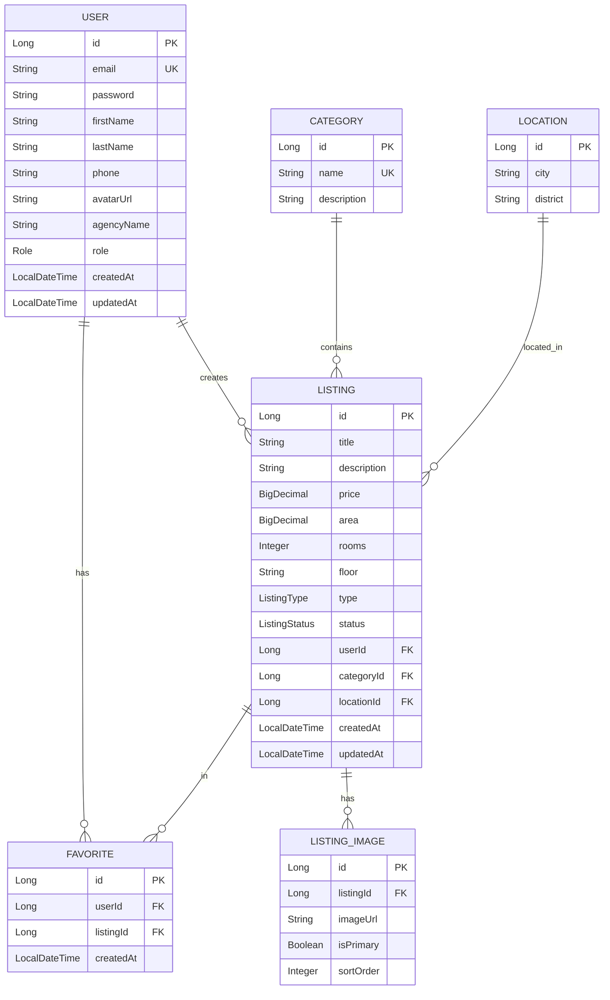

# DreamHome Backend - Plan Implementacji

## Cel

Stworzenie REST API backendu w Spring Boot dla platformy ogłoszeniowej nieruchomości DreamHome.

---

## Model Danych (Encje)

### Diagram Relacji



---

## Szczegóły Encji

### 1. User (Użytkownik)

| Pole | Typ | Opis |
|------|-----|------|
| `id` | Long | Klucz główny |
| `email` | String | Unikalny email (login) |
| `password` | String | Hasło (BCrypt) |
| `firstName` | String | Imię |
| `lastName` | String | Nazwisko |
| `phone` | String | Telefon kontaktowy |
| `avatarUrl` | String | URL awatara (nullable) |
| `agencyName` | String | Nazwa agencji (nullable, dla agentów) |
| `role` | Role (enum) | Rola użytkownika |
| `createdAt` | LocalDateTime | Data utworzenia |
| `updatedAt` | LocalDateTime | Data aktualizacji |

### 2. Role (Enum)

```java
public enum Role {
    USER,           // Poszukujący - może przeglądać, dodawać do ulubionych
    AGENT,          // Agent/Właściciel - może tworzyć ogłoszenia
    ADMIN           // Administrator - pełny dostęp
}
```

> [!IMPORTANT]
> **Analiza ról z dokumentacji:**
>
> - **Gość (niezalogowany)** - to NIE jest rola w bazie, obsługiwane przez brak autentykacji
> - **USER** = "Użytkownik Zalogowany (Poszukujący)" z dokumentacji
> - **AGENT** = "Ogłoszeniodawca (Agent/Właściciel)" z dokumentacji  
> - **ADMIN** = "Administrator" z dokumentacji
>
> Role mają sens i są zgodne z dokumentacją. Rola "Gość" nie wymaga wpisu w bazie.

### 3. Category (Kategoria)

| Pole | Typ | Opis |
|------|-----|------|
| `id` | Long | Klucz główny |
| `name` | String | Nazwa kategorii (unikalna) |
| `description` | String | Opis kategorii (nullable) |

**Przykładowe wartości:** Mieszkanie, Dom, Kawalerka, Lokal biurowy, Działka

### 4. Location (Lokalizacja)

| Pole | Typ | Opis |
|------|-----|------|
| `id` | Long | Klucz główny |
| `city` | String | Miasto |
| `district` | String | Dzielnica (nullable) |

**Przykład:** Gdynia - Orłowo, Gdańsk - Śródmieście

### 5. Listing (Ogłoszenie)

| Pole | Typ | Opis |
|------|-----|------|
| `id` | Long | Klucz główny |
| `title` | String | Tytuł ogłoszenia |
| `description` | String | Opis (TEXT) |
| `price` | BigDecimal | Cena w PLN |
| `area` | BigDecimal | Powierzchnia w m² |
| `rooms` | Integer | Liczba pokoi (nullable) |
| `floor` | String | Piętro np. "2/4" (nullable) |
| `type` | ListingType | Typ: SALE lub RENT |
| `status` | ListingStatus | Status ogłoszenia |
| `user` | User | Właściciel ogłoszenia (FK) |
| `category` | Category | Kategoria (FK) |
| `location` | Location | Lokalizacja (FK) |
| `createdAt` | LocalDateTime | Data utworzenia |
| `updatedAt` | LocalDateTime | Data aktualizacji |

### 6. ListingType (Enum)

```java
public enum ListingType {
    SALE,   // Sprzedaż
    RENT    // Wynajem
}
```

### 7. ListingStatus (Enum)

```java
public enum ListingStatus {
    ACTIVE,     // Aktywne
    RESERVED,   // Rezerwacja
    SOLD,       // Sprzedane/Wynajęte
    EXPIRED     // Wygasłe
}
```

### 8. ListingImage (Zdjęcie ogłoszenia)

| Pole | Typ | Opis |
|------|-----|------|
| `id` | Long | Klucz główny |
| `listing` | Listing | Ogłoszenie (FK) |
| `imageUrl` | String | URL zdjęcia |
| `isPrimary` | Boolean | Czy główne zdjęcie |
| `sortOrder` | Integer | Kolejność wyświetlania |

> [!TIP]
> Osobna tabela dla zdjęć (opcja A) jest najlepsza, bo:
>
> - Łatwe dodawanie/usuwanie pojedynczych zdjęć
> - Możliwość oznaczenia głównego zdjęcia
> - Sortowanie kolejności
> - Łatwa rozbudowa o metadane (alt text, thumbnails)

### 9. Favorite (Ulubione)

| Pole | Typ | Opis |
|------|-----|------|
| `id` | Long | Klucz główny |
| `user` | User | Użytkownik (FK) |
| `listing` | Listing | Ogłoszenie (FK) |
| `createdAt` | LocalDateTime | Data dodania |

**Constraint:** UNIQUE(user_id, listing_id)

---

## Struktura Pakietów

```
com.piotrcapecki.dreamhome/
├── config/
│   ├── SecurityConfig.java
│   └── CorsConfig.java
├── controller/
│   ├── AuthController.java
│   ├── UserController.java
│   ├── ListingController.java
│   ├── CategoryController.java
│   ├── LocationController.java
│   └── FavoriteController.java
├── dto/
│   ├── request/
│   │   ├── RegisterRequest.java
│   │   ├── LoginRequest.java
│   │   ├── ListingRequest.java
│   │   └── ...
│   └── response/
│       ├── AuthResponse.java
│       ├── UserResponse.java
│       ├── ListingResponse.java
│       └── ...
├── entity/
│   ├── User.java
│   ├── Category.java
│   ├── Location.java
│   ├── Listing.java
│   ├── ListingImage.java
│   └── Favorite.java
├── enums/
│   ├── Role.java
│   ├── ListingType.java
│   └── ListingStatus.java
├── exception/
│   ├── GlobalExceptionHandler.java
│   └── ResourceNotFoundException.java
├── repository/
│   ├── UserRepository.java
│   ├── CategoryRepository.java
│   ├── LocationRepository.java
│   ├── ListingRepository.java
│   ├── ListingImageRepository.java
│   └── FavoriteRepository.java
├── service/
│   ├── AuthService.java
│   ├── UserService.java
│   ├── ListingService.java
│   ├── CategoryService.java
│   ├── LocationService.java
│   └── FavoriteService.java
└── DreamHomeApplication.java
```

---

## API Endpoints (REST)

### Auth

| Metoda | Endpoint | Opis | Dostęp |
|--------|----------|------|--------|
| POST | `/api/auth/register` | Rejestracja | Public |
| POST | `/api/auth/login` | Logowanie | Public |

### Listings

| Metoda | Endpoint | Opis | Dostęp |
|--------|----------|------|--------|
| GET | `/api/listings` | Lista ogłoszeń + filtry | Public |
| GET | `/api/listings/{id}` | Szczegóły ogłoszenia | Public |
| POST | `/api/listings` | Dodaj ogłoszenie | AGENT, ADMIN |
| PUT | `/api/listings/{id}` | Edytuj ogłoszenie | Owner, ADMIN |
| DELETE | `/api/listings/{id}` | Usuń ogłoszenie | Owner, ADMIN |

### Categories & Locations

| Metoda | Endpoint | Opis | Dostęp |
|--------|----------|------|--------|
| GET | `/api/categories` | Lista kategorii | Public |
| POST | `/api/categories` | Dodaj kategorię | ADMIN |
| GET | `/api/locations` | Lista lokalizacji | Public |
| POST | `/api/locations` | Dodaj lokalizację | ADMIN |

### Favorites

| Metoda | Endpoint | Opis | Dostęp |
|--------|----------|------|--------|
| GET | `/api/favorites` | Moje ulubione | USER+ |
| POST | `/api/favorites/{listingId}` | Dodaj do ulubionych | USER+ |
| DELETE | `/api/favorites/{listingId}` | Usuń z ulubionych | USER+ |

### Users

| Metoda | Endpoint | Opis | Dostęp |
|--------|----------|------|--------|
| GET | `/api/users/me` | Mój profil | Authenticated |
| PUT | `/api/users/me` | Edytuj profil | Authenticated |
| GET | `/api/users` | Lista użytkowników | ADMIN |

---

## Proposed Changes

### [MODIFY] [pom.xml](file:///Users/c-gun77/Developer/AntiGravity/DreamHome-Java/backend/DreamHome/pom.xml)

- Dodanie `spring-boot-starter-data-jpa`
- Dodanie `spring-boot-starter-validation`
- Dodanie `jjwt` (JWT dla autentykacji)

### [MODIFY] [application.properties](file:///Users/c-gun77/Developer/AntiGravity/DreamHome-Java/backend/DreamHome/src/main/resources/application.properties)

- Konfiguracja PostgreSQL
- Konfiguracja JPA/Hibernate
- Konfiguracja JWT

### [NEW] Katalog `entity/` - 6 plików encji

### [NEW] Katalog `enums/` - 3 pliki enumów

### [NEW] Katalog `repository/` - 6 repozytoriów

### [NEW] Katalog `service/` - 6 serwisów

### [NEW] Katalog `controller/` - 6 kontrolerów

### [NEW] Katalog `dto/` - Request/Response DTOs

### [NEW] Katalog `config/` - Konfiguracja Security i CORS

### [NEW] Katalog `exception/` - Obsługa wyjątków

---

## Plan Weryfikacji

### Automatyczne

1. **Kompilacja projektu:**

   ```bash
   cd /Users/c-gun77/Developer/AntiGravity/DreamHome-Java/backend/DreamHome
   ./mvnw clean compile
   ```

2. **Uruchomienie testów jednostkowych:**

   ```bash
   ./mvnw test
   ```

### Manualne (po uruchomieniu serwera)

1. Uruchomienie aplikacji: `./mvnw spring-boot:run`
2. Test endpointu rejestracji przez curl/Postman
3. Test endpointu logowania
4. Test CRUD ogłoszeń

---

## Pytania do użytkownika

> [!NOTE]
> **Wiadomości** - Pominąłem funkcjonalność wiadomości (z dashboard wireframe). Zakładam, że to mockup na przyszłość. Potwierdź?
